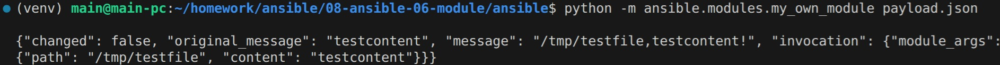
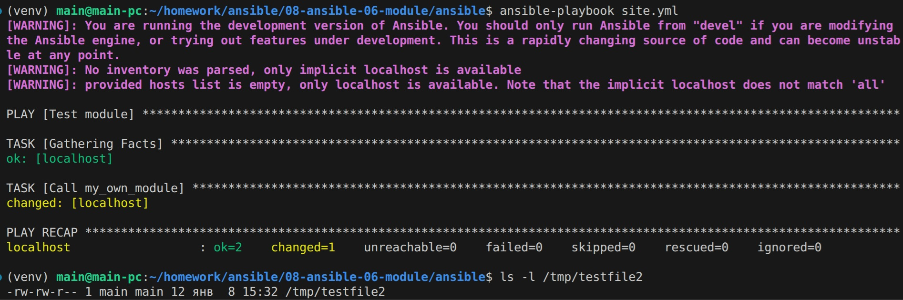
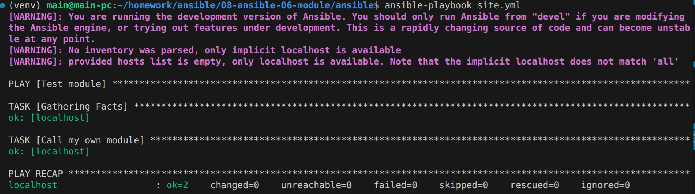
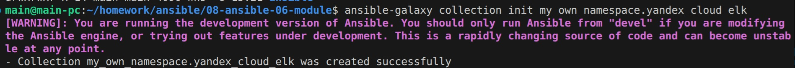
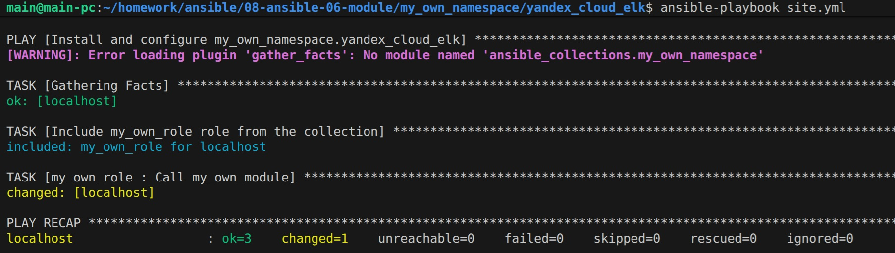
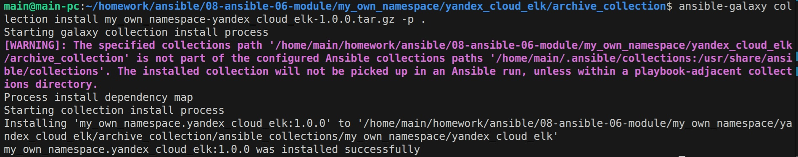
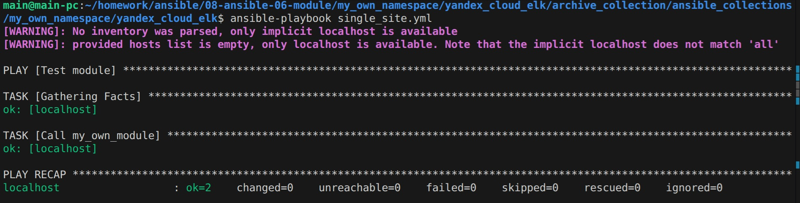

## Решение

Модуль:
https://github.com/cranberry511/my_own_collection/blob/1.0.0/my_own_namespace/yandex_cloud_elk/plugins/modules/my_own_module.py

1. Проверка module на исполняемость локально:

2. Запуск module через single task playbook:

3. Проверка на идемпотентность:

4. Инициализация collection:

5. Запуск playbook с использованием role:

Ссылка на collection:
https://github.com/cranberry511/my_own_collection/tree/1.0.0

6. Установка collection из локального архива:

Ссылка на архив:
https://github.com/cranberry511/my_own_collection/blob/1.0.1/my_own_namespace/yandex_cloud_elk/archive_collection/my_own_namespace-yandex_cloud_elk-1.0.0.tar.gz

7. Запуск single task playbook для проверки работы:
